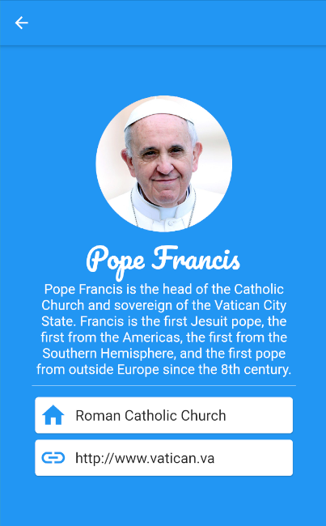
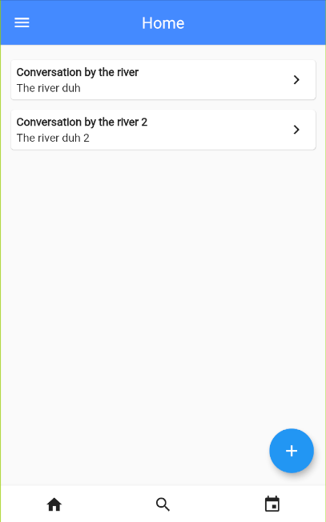
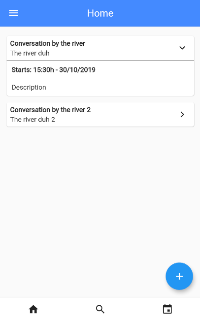
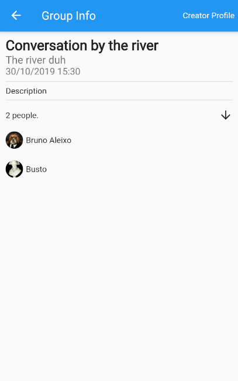
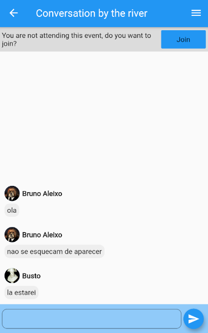
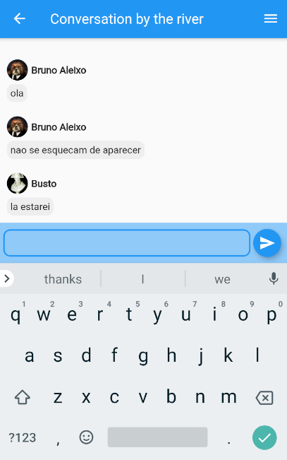
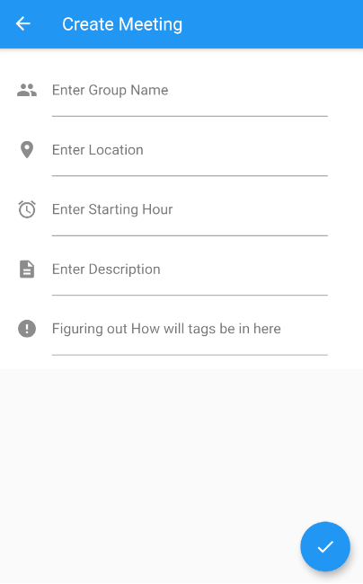
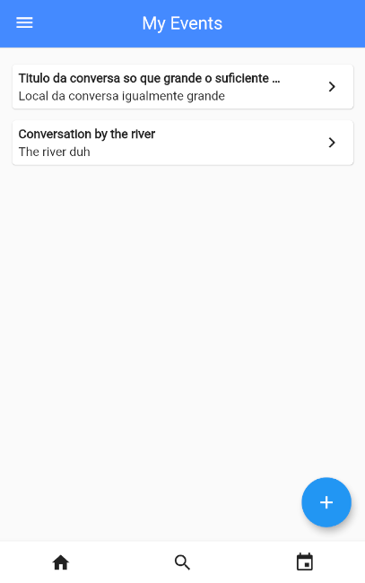

# openCX-teamwip Development Report

Welcome to the documentation pages of the BirdChat of **openCX**!

You can find here detailed about the (sub)product, hereby mentioned as module, from a high-level vision to low-level implementation decisions, a kind of Software Development Report (see [template](https://github.com/softeng-feup/open-cx/blob/master/docs/templates/Development-Report.md)), organized by discipline (as of RUP): 

* Business modeling 
  * [Product Vision](#Product-Vision)
  * [Elevator Pitch](#Elevator-Pitch)
* Requirements
  * [Use Case Diagram](#Use-case-diagram)
  * [User stories](#User-stories)
  * [Domain model](#Domain-model)
* Architecture and Design
  * [Logical architecture](#Logical-architecture)
  * [Physical architecture](#Physical-architecture)
  * [Prototype](#Prototype)
* [Implementation](#Implementation)
* [Test](#Test)
* [Configuration and change management](#Configuration-and-change-management)
* [Project management](#Project-management)

So far, contributions are exclusively made by the initial team, but we hope to open them to the community, in all areas and topics: requirements, technologies, development, experimentation, testing, etc.

Please contact us! 

Thank you!

*Afonso Mendoça, Moisés Rocha, Paulo Marques, Tomás Figueiredo*

---
## Product Vision

This product's aim is to facilitate informal discussions in conferences, providing a way for people with similar interests to find each other.

---
## Elevator Pitch

BirdChat aims to help people find other people to talk with on conferences.
This enables them to spend more time discussing and exchanging ideas and less time actually looking for someone iterested in a talk, or usually just wasting it on a listening on conversations they are not interested in.


---
## Requirements

### Use case diagram 

Use case image


#### View Profile:

*  **Actor**. Conference attendee.

*  **Description**. This use case exists so that the attendee can view his own profile.

*  **Preconditions and Postconditions**.  In order to view the profile, the attendee must be logged in. In the end, the user will be able to see his personal information.
  
*  **Normal Flow**. 
	1. The attendee presses the button to show the sidebar from the Home/My Events page.
	2. The system will display a sidebar.
	3. The attendee presses the 'My Profile' button.
	4. The system will display the attendee's personal information.


#### View New Events:

*  **Actor**. Conference attendee.

*  **Description**. This use case exists so that the attendee can view the most recente created events.

*  **Preconditions and Postconditions**.  In order to view new events, the attendee must be logged in. In the end, the user will be able to see a list of new events with their title and description.
  
*  **Normal Flow**. 
	1. The attendee presses the 'Home' button.
	2. The system will load and display the most recent events.


#### View Event's Details:

*  **Actor**. Conference attendee.

*  **Description**. This use case exists so that the attendee can view any event's details.

*  **Preconditions and Postconditions**.  In order to view an event's details, the attendee must be logged in. In the end, the user will be able to see an event's details.
  
*  **Normal Flow**. 
	1. The attendee presses the home button.
	2. The system will load and display the most recent events.
	3. The attendee presses the arrow button on the event's card.
	4. The system will expand the card showing its details.

*  **Alternative Flows and Exceptions**. 
	1. The attendee presses the home button.
	2. The system will load and display the most recent events.
	3. The attendee presses the event's title.
	4. The system will show the event's chat.
	5. The attendee presses the details button.
	6. The system will display the event's details.


#### Join Event:

*  **Actor**. Conference attendee.

*  **Description**. This use case exists so that the attendee can join an event.

*  **Preconditions and Postconditions**.  In order to join an event, the attendee must be logged in. In the end, the user will be joined to that event.
  
*  **Normal Flow**. 
  1. The attendee presses the home button.
	2. The system will load and display the most recent events.
	3. The attendee presses the event's title.
	4. The system will show the event's chat.
	5. The attendee presses the join button.
	6. The system will remove the join button.
	

#### Use Event's Chat:

*  **Actor**. Conference attendee.

*  **Description**. This use case exists so that the attendee can use the event's chat.

*  **Preconditions and Postconditions**.  In order to use an event's chat, the attendee must be logged in and joined to the event. In the end, the user will be able to use the event's chat.
  
*  **Normal Flow**. 
  1. The attendee presses the home button.
  2. The system will load and display the most recent events.
  3. The attendee presses the event's title.
  4. The system will show the event's chat.

	
#### Create Event:

*  **Actor**. Conference attendee.

*  **Description**. This use case exists so that the attendee can create new events.

*  **Preconditions and Postconditions**.  In order to create an event, the attendee must be logged in. In the end, the user will be manage an event.
  
*  **Normal Flow**. 
  1. The attendee presses the home button.
	2. The system will load and display the most recent events.
	3. The attendee presses the create event button.
	4. The system will show a form fot he attendee to fill.
	5. The attendee fills the form's requirements.
	6. If the form is correctly filled, the system creates a new event.
	
*  **Alternative Flows and Exceptions**. 
	1. The attendee presses the home button.
	2. The system will load and display the most recent events.
	3. The attendee presses the create event button.
	4. The system will show a form fot he attendee to fill.
	5. The attendee fills the form's requirements.
	6. If the form is filled incorrectly, the system displays an error message.
	7. The attendee will be able to refill the form and proceed as normal.


#### View Joined Events:

*  **Actor**. Conference attendee.

*  **Description**. This use case exists so that the attendee can view the event's he's a part of.

*  **Preconditions and Postconditions**.  In order to view joined events, the attendee must be logged in. In the end, the user will be manage to view a list of all of his joined events.
  
*  **Normal Flow**. 
    1. The attendee presses the 'My Events' button.
	  2. The system will load and display his joined events.


### User stories

#### Story #1

As a conference attendee, I want to be able to view my own profile, so that I get to check my personal information.

**User interface mockup**



**Acceptance tests**

```
Scenario: In home page, navigate to user profile page
    Given I have "HomePage" visible
    When I open the drawer
    And I tap the "MyProfileButton" button
    Then I should have "ProfilePage" page on screen
```

**Value and effort**

Value:

Effort:

#### Story #2

As a conference attendee, I want to be able to view new events, so that I can choose which ones interest me.

**User interface mockup**



**Acceptance tests**

```
```

**Value and effort**

Value:

Effort:

#### Story #3

As a conference attendee, I want to be able to view an event's details, so that I can see more of its information.

**User interface mockup**




**Acceptance tests**

```
```

**Value and effort**

Value:

Effort:

#### Story #4

As a conference attendee, I want to be able to join an event, so that I can meet and chat with other attendees.

**User interface mockup**



**Acceptance tests**

```
```

**Value and effort**

Value:

Effort:


#### Story #5

As a conference attendee, I want to be able to use an events chat, so that I can speak with the other attendees.

**User interface mockup**



**Acceptance tests**

```
```

**Value and effort**

Value:

Effort:

#### Story #6

As a conference attendee, I want to be able to create a new event, so that I can chat and meet up with other attendees.

**User interface mockup**



**Acceptance tests**

```
```

**Value and effort**

Value:

Effort:

#### Story #7

As a conference attendee, I want to be able to view the events that I've already joined, so that I can continue to be updated with their current situation.

**User interface mockup**



**Acceptance tests**

```
```

**Value and effort**

Value:

Effort:


### Domain model


---
## Project Management

Links to tools that we are using to help us in **project management**:
 * [Trello](https://trello.com/invite/b/NQOzfzT2/323d1af03456baaf1cf2993b6226a9fd/birdchat)

